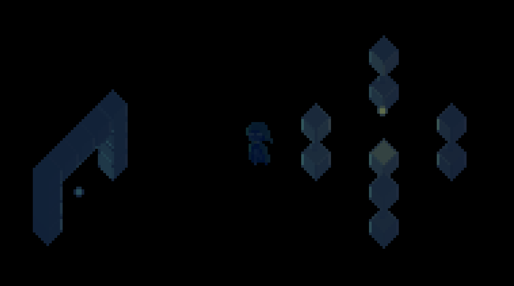

# Neon Hunter

Its a game where you hunt bosses in neon colors and a great darck theme with shaders and fancy shit.

### ! everithing follows the roule of the left hand because in sfml is easier that way.

## file structure

assets is compiletime stuff
build is runtime stuff

### next is the movement phisics, attack states for player and mechanincs, passing the entities to the shader to calculate shadows 
